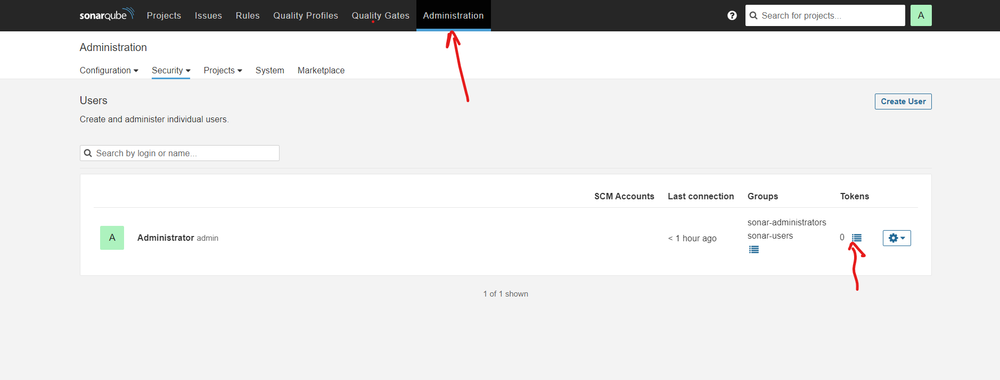
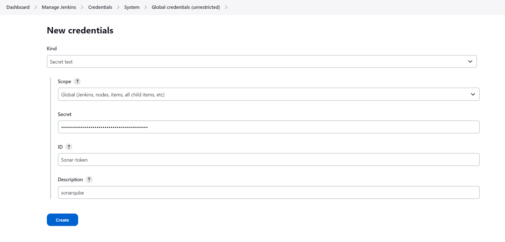
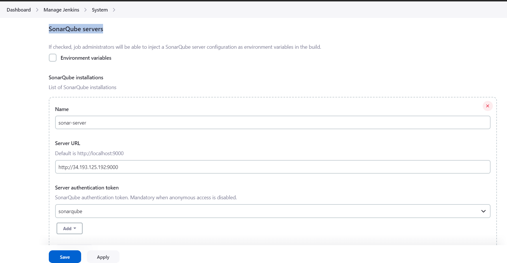
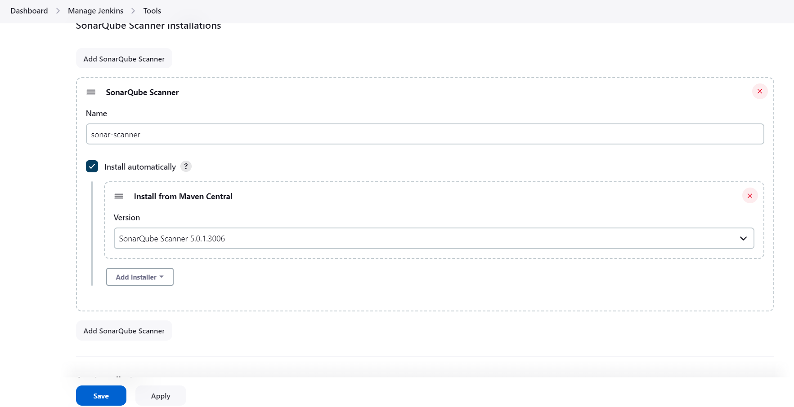
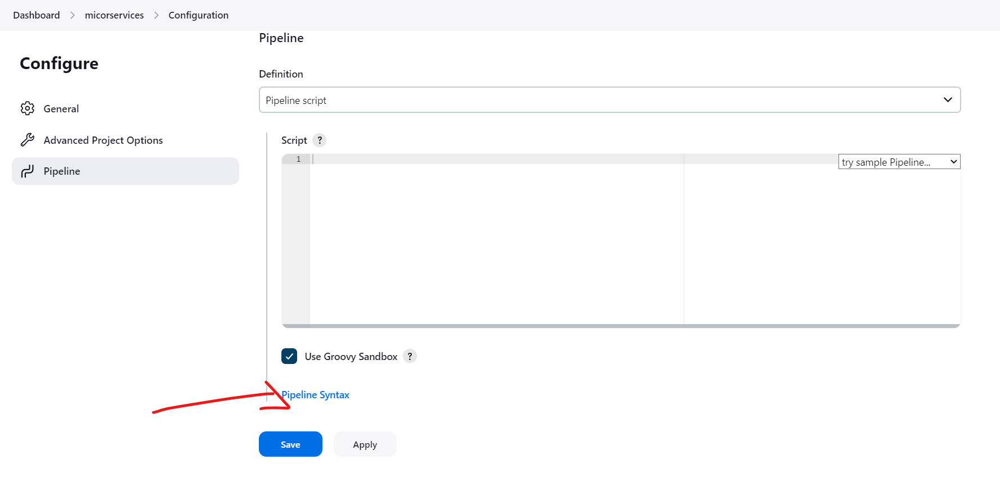
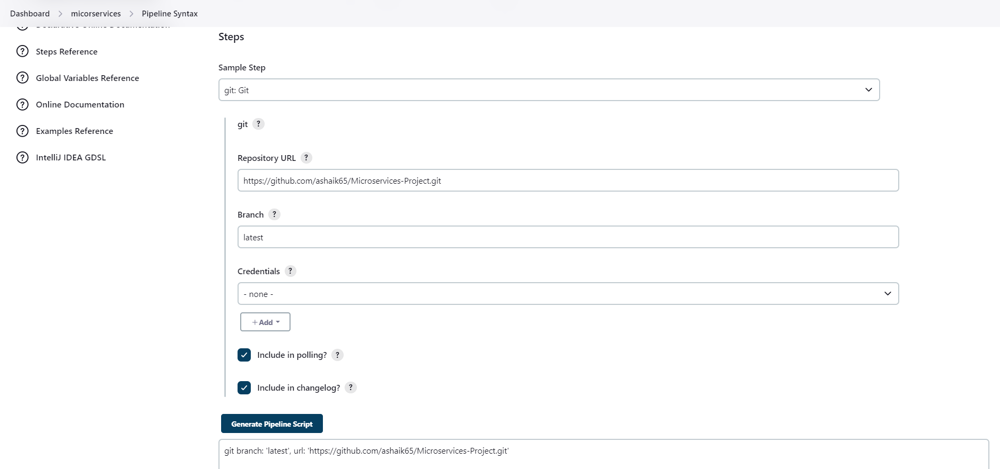

#### To proceed with this project follow this steps ####
```yaml

1. Take one t2.2xlarge ubuntu machine on that machine we need install jenkins and sonarqube also we need to treat this machine as bastion host
Open Port:- 8080, 22, 9000

2. Install the AWS CLI : https://docs.aws.amazon.com/cli/latest/userguide/getting-started-install.html
curl "https://awscli.amazonaws.com/awscli-exe-linux-x86_64.zip" -o "awscliv2.zip"
sudo apt install unzip
unzip awscliv2.zip
sudo ./aws/install
aws --version

3. Installing kubectl : https://docs.aws.amazon.com/eks/latest/userguide/install-kubectl.html

curl -O https://s3.us-west-2.amazonaws.com/amazon-eks/1.27.7/2023-11-14/bin/linux/amd64/kubectl

chmod +x ./kubectl

mkdir -p $HOME/bin && cp ./kubectl $HOME/bin/kubectl && export PATH=$HOME/bin:$PATH

echo 'export PATH=$HOME/bin:$PATH' >> ~/.bashrc

kubectl version --short --client

4. Installing eksctl : https://docs.aws.amazon.com/eks/latest/userguide/eksctl.html#installing-eksctl

curl --silent --location "https://github.com/weaveworks/eksctl/releases/latest/download/eksctl_$(uname -s)_amd64.tar.gz" | tar xz -C /tmp

sudo mv /tmp/eksctl /usr/local/bin

eksctl version

5. Configure AWS Command Line using Security Credentials
Go to AWS Management Console --> Services --> IAM
Select the IAM User: <your_iam_user_name>
Important Note: Use only IAM user to generate Security Credentials. Never ever use Root User. (Highly not recommended)
Click on Security credentials tab
Click on Create access key
Copy Access ID and Secret access key
Go to command line and provide the required details

aws configure
AWS Access Key ID [None]: XXXXXXXXXXXXXXXXXX  (Replace your creds when prompted)
AWS Secret Access Key [None]: XXXXXXXXXXXXXXXXXXXXXXXXXXX  (Replace your creds when prompted)
Default region name [None]: us-east-1
Default output format [None]: json

aws ec2 describe-vpcs

6. Create EKS cluster using single CMD

eksctl create cluster --name eksdemo --version 1.27 --region us-east-1 --nodegroup-name eksdemo-ng --node-type t3.medium --nodes 3 --managed

7. Create & Associate IAM OIDC Provider for our EKS Cluster
To enable and use AWS IAM roles for Kubernetes service accounts on our EKS cluster, we must create & associate OIDC identity provider.
To do so using eksctl we can use the below command.

eksctl utils associate-iam-oidc-provider \
    --region us-east-1 \
    --cluster eksdemo \
    --approve

8. Install-EBS-CSI-Driver

https://docs.aws.amazon.com/eks/latest/userguide/csi-iam-role.html

https://docs.aws.amazon.com/eks/latest/userguide/managing-ebs-csi.html


9. Install Jenkins on the machine 

# Install Java First

sudo apt update
sudo apt install fontconfig openjdk-17-jre -y
java -version

# Install Jenkins

sudo wget -O /usr/share/keyrings/jenkins-keyring.asc \
https://pkg.jenkins.io/debian-stable/jenkins.io-2023.key
echo deb [signed-by=/usr/share/keyrings/jenkins-keyring.asc] \
https://pkg.jenkins.io/debian-stable binary/ | sudo tee \
/etc/apt/sources.list.d/jenkins.list > /dev/null
sudo apt-get update
sudo apt-get install jenkins -y
sudo systemctl start jenkins
sudo systemctl enable jenkins

10. Install sonarqube 

# To install sonarqube we need docker as we will deploy sonarqube as docker container

# Install Docker 


sudo apt-get update
sudo apt-get install docker.io -y
sudo usermod -aG docker $USER  # Replace with your system's username, e.g., 'ubuntu'
newgrp docker
sudo chmod 777 /var/run/docker.sock

# Install sonarqube

docker run -d --name sonar -p 9000:9000 sonarqube:lts-community   # Access this with your ip on 9000

11. Install Necessary Plugins in Jenkins:	
SonarQube Scanner
Kubernetes
Kubernetes Cli
Docker
Docker-pipeline
```
# SonarQube
Create the token in sonarqube for that goto sonarqube -----> Click on Administration----->click on token and genrate the token



Goto Jenkins Dashboard → Manage Jenkins → Credentials → Add Secret Text. It should look like this



After adding sonar token

Click on Apply and Save

The Configure System option is used in Jenkins to configure different server

Global Tool Configuration is used to configure different tools that we install using Plugins

We will install a sonar scanner in the tools.

managed jenkins ------> Configure system ------> SonarQube servers mentioned the details as shown in snippet once done apply and save




we also need SonarQube Scanner installations for that goto Manage jenkins-----> Tools -----> SonarQube Scanner installations fill the details like this after did this click on Apply and Save




# Docker

Now add docker creds into jenkins credentials make sure create token in dockerhub registry and treat that as a password

Also install docker like we install sonarqube for refernce see this screenshot click apply and save


# Kubernetes

1. Create Namespace webapps

kubectl create ns webapps

2. Create SA, Role, Rolebinding as given in our repo

kubectl create -f sa.yaml

kubectl create -f role.yaml

kubectl create -f binding.yaml

# Now we need to do some pipeline releated things 

1. github checkout stage how to do that



now go to pipeline syntax and generate pipeline syntax for github select this option



After that click on genrate pipeline syntax copy that and paste in pipeline stage


